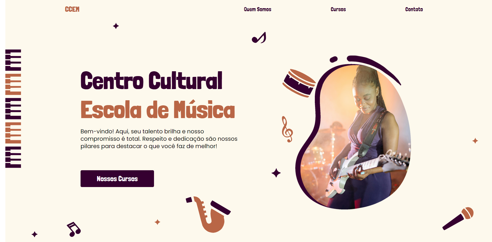

# Landing Page CCEM - Centro Cultural Escola de Música





<br>


Este projeto é uma landing page desenvolvida para o Centro Cultural Escola de Música (CCEM), com o objetivo de proporcionar uma presença digital moderna, atraente e funcional. A página foi criada pensando na conversão de visitantes em alunos, destacando os cursos oferecidos, depoimentos de alunos, além de uma seção para contato e agendamento de visitas.

<br>

<a href="https://site-react-ccem-escola-de-musica.vercel.app/" target="_blank">🎁CLIQUE AQUI🎁</a> e acesse o deploy do projeto!

<br>

## 💻 Tecnologias usadas
- HTML5: Estrutura semântica e otimizada para SEO.
- CSS3: Layout responsivo e estilização moderna, utilizando técnicas como Flexbox e Grid para garantir que a página seja visualmente atraente em qualquer dispositivo.
- JavaScript: Funcionalidades interativas, como animações suaves e validação de formulário.
- React: Framework que facilita a interação do JavaScript no projeto.
- Styled Components: Componetização da folha de estilos no projeto.

## 🚀 Como Utilizar

1 - Clone o projeto

```
git clone "https://github.com/ulissesmarciano/site-react-ccem-escola-de-musica.git"
```
2 Acesse a pasta do projeto

```
cd site-react-ccem-escola-de-musica
```

3 Inicializando o projeto

```
npm start
```

Obs. Para o pleno funcionamento do projeto utilize a instalação da biblioteca do React js, Axios , Styled Components e React Router Dom.


### 🧰 Ajustes e melhorias

O projeto ainda está em desenvolvimento e as próximas atualizações serão voltadas nas seguintes tarefas:

- [x] Instalação da biblioteca
- [x] Criação e parametrização dos componentes nas páginas
- [x] Responsividade com Mobile First
- [x] Renderização e criação das lógicas para os componentes
- [x] Realizar o deploy com um link para exposição no github.
- [ ] Inizialização das rotas e criação das páginas

